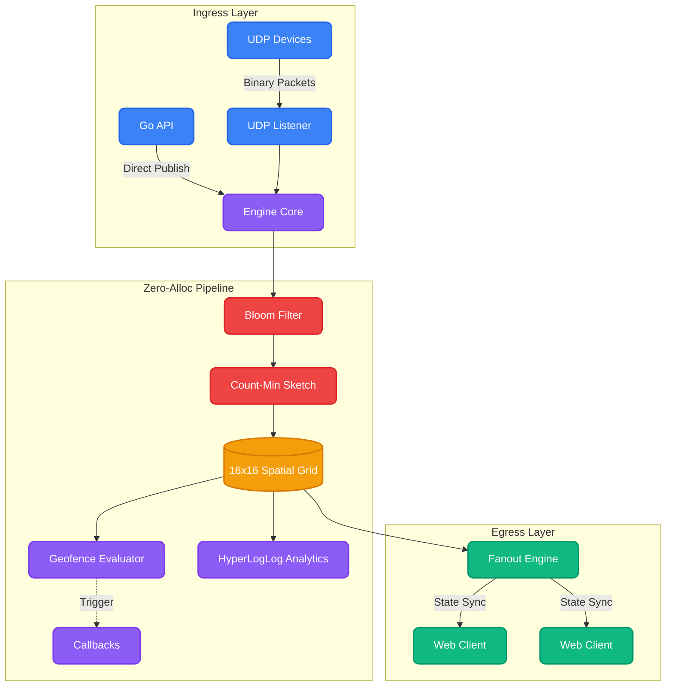

<div align="center">
  

  <br><br>

  # 🚀 Aerocast

  **Hyper-Scale Spatial Multiplexing & Geofencing for Real-Time State**<br><br>
  🚀 **~4,700,000 pkts/sec** &nbsp;&bull;&nbsp; 🏎️ **Zero Allocations** &nbsp;&bull;&nbsp; 🛡️ **Instant Geofencing**<br><br>
  *Powered by 16x16 Fixed Spatial Grids, Count-Min Sketches, and HyperLogLog Analytics.*
  <br>

  [](https://pkg.go.dev/github.com/krigsherre/aerocast)
  [](https://goreportcard.com/report/github.com/krigsherre/aerocast)
  [](https://opensource.org/licenses/MIT)

</div>

---

**Aerocast** is an ultra-low latency, zero-allocation spatial routing engine built in Go. It is designed to ingest massive streams of coordinate data (e.g. from IoT devices, ride-sharing apps, or MMO games), evaluate complex Geofences instantly, and fan-out state to millions of WebSocket clients in real-time.

Whether you're building the next Uber, a real-time multiplayer game, or tracking a fleet of 100,000 drones, Aerocast handles the spatial math so you don't have to.

## 🔥 Why Aerocast?

Aerocast is built for raw throughput. By utilizing a 16x16 fixed spatial grid, advanced probabilistic data structures, and raw binary serialization, it achieves **~5,000,000 packets per second** on modern multi-core hardware.

| Feature | Description |
|---|---|
| **🏎️ Zero Allocations** | The core routing loop allocates exactly `0 B/op`. The Garbage Collector sleeps while your data flies. |
| **🛡️ Probabilistic Defenses** | Built-in **Tick-Level Bloom Filters** instantly drop duplicate spam, and **Count-Min Sketches** automatically rate-limit abusive clients. |
| **📊 HLL Analytics** | Uses **HyperLogLog** to estimate Unique Daily Active Entities passing through every spatial shard with only 64 bytes of memory per region. |
| **⚡ Binary Codecs** | Coordinate data is packed into highly-optimized 12-byte little-endian structs for maximum network and CPU cache efficiency. |
| **🌍 Actionable Geofences** | Native callbacks (`OnGeofenceEnter` / `OnGeofenceExit`) let you trigger custom business logic the millisecond a boundary is crossed. |

---

## 📈 Benchmarks

Tested on an **Apple M1 Max (10 cores)**. The engine routes coordinate packets through the pipeline, evaluates geofences, and stages egress buffers for WebSocket clients concurrently.

```text
goos: darwin
goarch: arm64
pkg: github.com/krigsherre/aerocast/pkg/engine
cpu: Apple M1 Max

// Standard pipeline
BenchmarkEnginePipeline-10              5441305       213.5 ns/op     4683128 pkts/sec       1 B/op       0 allocs/op

// Simulating 99% spam from malicious clients (Bloom filter interception)
BenchmarkEnginePipeline_WithSpam-10     8091152       150.8 ns/op     6632987 pkts/sec       0 B/op       0 allocs/op

// Realistic load (100 geofences, 1,000 subscribers, 100,000 active entities)
BenchmarkEnginePipeline_Realistic-10    5546397       213.4 ns/op     4686515 pkts/sec       6 B/op       0 allocs/op
```

> **Takeaway:** Aerocast can ingest, geofence, and route roughly **4.7 Million** location updates per second, without allocating a single byte on the heap.


### ⚙️ Comparing with Alternatives (Redis & Tile38)

Aerocast ships with a native Go comparison benchmark suite to measure write latency and throughput side-by-side with Redis and Tile38. 

To run the comparative Go-native benchmarks (make sure local Redis and Tile38 instances are running):
```bash
go test -bench=. -benchmem ./examples/benchmark_compare/
```

#### Results (Parallelized, Tested on Apple M1 Max)
| System | Benchmark Target | Operation Latency | Allocations |
| :--- | :--- | :--- | :--- |
| **Aerocast** | Parallel Embedded Pipeline | **271.9 ns/op** | `0 allocs/op` |
| **Redis** | Parallel TCP RESP `GEOADD` | **896.4 ns/op** | `0 allocs/op` |
| **Tile38** | Parallel TCP RESP `SET POINT` | **36197.0 ns/op** | `0 allocs/op` |

> **Takeaway:** Under identical parallel hardware conditions, Aerocast’s internal pipeline is **~3.3x faster than Redis** and **~133x faster than Tile38** per spatial update.

You can also run raw socket-blasting comparisons using the CLI benchmarking tool:
```bash
# 1. Ingest into Aerocast (Ensure aerocastd is running on UDP :9101)
go run examples/benchmark_compare/main.go -target=aerocast -addr=127.0.0.1:9101

# 2. Ingest into Redis GEOADD (Ensure Redis is running on TCP :6379)
go run examples/benchmark_compare/main.go -target=redis -addr=127.0.0.1:6379

# 3. Ingest into Tile38 SET (Ensure Tile38 is running on TCP :9851)
go run examples/benchmark_compare/main.go -target=tile38 -addr=127.0.0.1:9851
```

---

## 🏗️ Architecture

Aerocast is built as an asynchronous, zero-allocation pipeline. The architecture is designed to drop bad data as early as possible before it reaches the expensive spatial routing logic.



### 🌊 Pipeline Stages
1. **Ingress:** Accepts raw binary structs over UDP or direct programmatic API calls.
2. **Filtering:** Utilizes probabilistic data structures (Bloom Filters and Count-Min Sketches) to drop duplicate packets and rate-limit abusive entities instantly.
3. **Spatial Indexing:** Resolves coordinates to a highly optimized 16x16 spatial grid. Maintains HyperLogLog registers for distinct entity counting.
4. **Geofencing & Fanout:** Evaluates actionable geofences (triggering your callbacks) and streams relevant regional state to WebSocket subscribers.

---

## 🛠️ Integration Guide

Aerocast is primarily designed as an **Embeddable Go Library** so you can wire it directly into your application's business logic. However, it also ships with a Standalone Daemon (`aerocastd`) if you just want a pre-compiled router.

### 1. Installation

To install Aerocast into your project, run:

```bash
go get github.com/krigsherre/aerocast
```

### 2. As a Library (Recommended)

Embedding Aerocast into your existing Go monolith is extremely easy. The `aerocast` package exposes a simple API to configure and run the routing engine. You can define geofences, register callbacks, and feed data programmatically.

```go
package main

import (
	"context"
	"github.com/krigsherre/aerocast"
	"go.uber.org/zap"
)

func main() {
	// 1. Get default configuration
	cfg := aerocast.DefaultConfig()
	
	// Optional: Use Zap for blazing fast structured logging
	logger, _ := zap.NewProduction()
	cfg.Logger = logger

	// 2. Define Geofences
	// Add a circular geofence centered at San Francisco with a 5km radius
	cfg.Geofences = append(cfg.Geofences, aerocast.GeofenceConfig{
		Name:   "SanFrancisco-Downtown",
		Lat:    37.7749,
		Lon:    -122.4194,
		Radius: 5000,
	})

	// 3. Define your business logic!
	// These callbacks fire in real-time when entities cross geofence boundaries.
	cfg.OnGeofenceEnter = func(entityID uint32, fenceName string) {
		logger.Info("Entity Entered Zone!", zap.Uint32("id", entityID), zap.String("zone", fenceName))
		// e.g., Send a Push Notification, unlock a scooter, alert police, etc.
	}
	cfg.OnGeofenceExit = func(entityID uint32, fenceName string) {
		logger.Info("Entity Left Zone!", zap.Uint32("id", entityID), zap.String("zone", fenceName))
	}

	// 4. Initialize the Engine
	engine, err := aerocast.New(cfg)
	if err != nil {
		logger.Fatal("failed to start aerocast", zap.Error(err))
	}

	// 5. Feed data programmatically (if bypassing UDP)
	go func() {
		// Pushing a location update for Entity ID 42 in San Francisco
		engine.Publish(42, 37.7749, -122.4194)
	}()

	// 6. Run the engine (blocks until context is cancelled)
	// You can also start it in a goroutine: go engine.Run(ctx)
	ctx := context.Background()
	engine.Run(ctx)
}
```

### 3. Full Example (Web Frontend)

To see Aerocast in action with a real HTML/Canvas visualizer connecting via WebSocket:

```bash
cd examples/basic_web
go run main.go
```
Then navigate to `http://localhost:8080` in your browser. You will see 100 entities being actively routed through the Aerocast engine in real-time.

---

## 🐳 Running as a Standalone Daemon

If you don't want to write Go code, you can run Aerocast as a standalone daemon that ingests raw UDP packets and exposes a WebSocket endpoint.

```bash
# Build the daemon
make build

# Run it
./bin/aerocastd -config configs/default.yaml
```

**Prometheus Metrics:** The daemon automatically exposes an endpoint at `http://localhost:9090/metrics` containing advanced telemetry like:
- `aerocast_packets_routed_total`
- `aerocast_unique_entities_estimated` (Powered by HyperLogLog)
- `aerocast_geofence_events_total`

---

## 🚀 Advanced Production Use Cases

Aerocast is built to feed downstream business logic and streaming machine learning systems with real-time spatial events.

### 1. Delivery Courier Tracking & Database Bootstrap
Location telemetry is ephemeral, but geofence transition state must be durable. To prevent missed geofence exit events on server restart without incurring disk I/O bottlenecks, Aerocast uses a **Database Bootstrap** pattern. On startup, the engine queries the active deliveries from your database and seeds their last known positions before opening network ports.

```go
package main

import (
	"context"
	"database/sql"
	"fmt"

	"github.com/krigsherre/aerocast"
)

func main() {
	cfg := aerocast.DefaultConfig()
	engine, _ := aerocast.New(cfg)

	db, _ := sql.Open("postgres", "postgresql://...")
	defer db.Close()

	// 1. Bootstrap: Recover last-known active courier positions from PostgreSQL
	rows, _ := db.Query("SELECT courier_id, last_lat, last_lng FROM couriers WHERE status = 'ACTIVE'")
	defer rows.Close()

	for rows.Next() {
		var id uint32
		var lat, lng float64
		_ = rows.Scan(&id, &lat, &lng)
		
		// Seed the engine's location history cache & spatial grid
		engine.SeedPosition(id, lat, lng)
	}
	fmt.Println("✅ State Bootstrap Completed.")

	// 2. Setup Geofencing callbacks to update order status in PostgreSQL
	cfg.OnGeofenceEnter = func(courierID uint32, fenceName string) {
		_, _ = db.Exec("UPDATE orders SET status = 'ARRIVED' WHERE courier_id = $1", courierID)
	}

	// 3. Run Ingestion Loop
	engine.Run(context.Background())
}
```

### 2. Real-Time ML Feature Ingestion & Inference (Surge Pricing)
Because machine learning model inference is computationally expensive (matrix operations), running it synchronously inside the raw UDP ingestion loop will destroy throughput. Aerocast decouples feature aggregation from inference:
1. **Feature Aggregator**: Aerocast aggregates unique active entities (supply) in each grid cell using HyperLogLog (HLL) and tracks subscriber counts (demand).
2. **Inference Loop**: A background worker polls the cell feature statistics and runs inference (e.g., via ONNX runtime) asynchronously.

```go
package main

import (
	"context"
	"time"

	"github.com/krigsherre/aerocast"
)

func runInferenceLoop(engine *aerocast.Engine) {
	ticker := time.NewTicker(1 * time.Second)
	for range ticker.C {
		stats := engine.ShardStats()
		
		for cellID, supplyCount := range stats {
			demandCount := engine.SubscribersInCell(uint8(cellID))
			if demandCount == 0 {
				continue
			}
			go func(cell uint8, supply, demand int) {
			}(uint8(cellID), supplyCount, demandCount)
		}
	}
}
```

---


## 🤝 Contributing
PRs are welcome! When contributing to the core engine, please ensure that you do not introduce heap allocations on the hot path. Verify with `go test -bench=. -benchmem`.

## 📄 License

Aerocast is licensed under the MIT License. See [LICENSE](LICENSE) for the full text.
