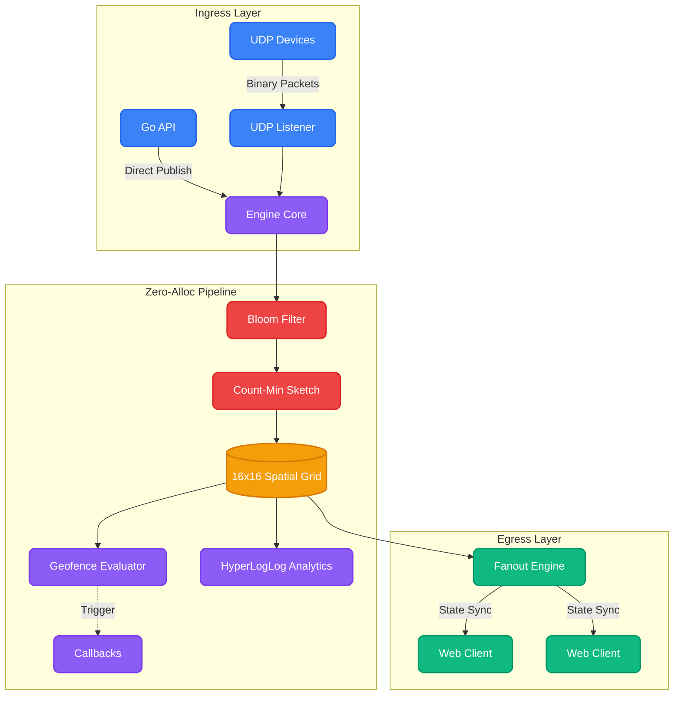

<div align="center">
  <br>
  
  <h1>🚀 Aerocast</h1>
  <p><b>Hyper-Scale Spatial Multiplexing & Geofencing for Real-Time State</b></p>
  <br>
  
  <a href="https://pkg.go.dev/github.com/krigsherre/aerocast">
    
  </a>
  <a href="LICENSE">
    
  </a>
  <a href="#performance">
    
  </a>
</div>

---

**Aerocast** is an ultra-low latency, zero-allocation spatial routing engine built in Go. It is designed to ingest massive streams of coordinate data (e.g. from IoT devices, ride-sharing apps, or MMO games), evaluate complex Geofences instantly, and fan-out state to millions of WebSocket clients in real-time.

Whether you're building the next Uber, a real-time multiplayer game, or tracking a fleet of 100,000 drones, Aerocast handles the spatial math so you don't have to.

## 🔥 Why Aerocast?

Aerocast is built for raw throughput. By utilizing a 16x16 fixed spatial grid, advanced probabilistic data structures, and raw binary serialization, it achieves **~5,000,000 packets per second** on modern multi-core hardware.

| Feature | Description |
|---|---|
| **🏎️ Zero Allocations** | The core routing loop allocates exactly `0 B/op`. The Garbage Collector sleeps while your data flies. |
| **🛡️ Probabilistic Defenses** | Built-in **Tick-Level Bloom Filters** instantly drop duplicate spam, and **Count-Min Sketches** automatically rate-limit abusive clients. |
| **📊 HLL Analytics** | Uses **HyperLogLog** to estimate Unique Daily Active Entities passing through every spatial shard with only 64 bytes of memory per region. |
| **⚡ Binary Codecs** | Coordinate data is packed into highly-optimized 12-byte little-endian structs for maximum network and CPU cache efficiency. |
| **🌍 Actionable Geofences** | Native callbacks (`OnGeofenceEnter` / `OnGeofenceExit`) let you trigger custom business logic the millisecond a boundary is crossed. |

---

## 📈 Benchmarks

Tested on an **Apple M1 Max (10 cores)**. The engine routes coordinate packets through the pipeline, evaluates geofences, and stages egress buffers for WebSocket clients concurrently.

```text
goos: darwin
goarch: arm64
pkg: github.com/krigsherre/aerocast/pkg/engine
cpu: Apple M1 Max

// Standard pipeline
BenchmarkEnginePipeline-10              5555604       216.4 ns/op     4621264 pkts/sec       0 B/op       0 allocs/op

// Simulating 99% spam from malicious clients (Bloom filter interception)
BenchmarkEnginePipeline_WithSpam-10     8382646       141.0 ns/op     7093905 pkts/sec       0 B/op       0 allocs/op

// Realistic load (100 geofences, 1,000 subscribers, 100,000 active entities)
BenchmarkEnginePipeline_Realistic-10    5326860       199.0 ns/op     5025355 pkts/sec       0 B/op       0 allocs/op
```

> **Takeaway:** Aerocast can ingest, geofence, and route roughly **4.7 Million** location updates per second, without allocating a single byte on the heap.

---

## 🏗️ Architecture

Aerocast is built as an asynchronous, zero-allocation pipeline. The architecture is designed to drop bad data as early as possible before it reaches the expensive spatial routing logic.



### 🌊 Pipeline Stages
1. **Ingress:** Accepts raw binary structs over UDP or direct programmatic API calls.
2. **Filtering:** Utilizes probabilistic data structures (Bloom Filters and Count-Min Sketches) to drop duplicate packets and rate-limit abusive entities instantly.
3. **Spatial Indexing:** Resolves coordinates to a highly optimized 16x16 spatial grid. Maintains HyperLogLog registers for distinct entity counting.
4. **Geofencing & Fanout:** Evaluates actionable geofences (triggering your callbacks) and streams relevant regional state to WebSocket subscribers.

---

## 🛠️ Integration Guide

Aerocast is primarily designed as an **Embeddable Go Library** so you can wire it directly into your application's business logic. However, it also ships with a Standalone Daemon (`aerocastd`) if you just want a pre-compiled router.

### 1. Installation

To install Aerocast into your project, run:

```bash
go get github.com/krigsherre/aerocast
```

### 2. As a Library (Recommended)

Embedding Aerocast into your existing Go monolith is extremely easy. The `aerocast` package exposes a simple API to configure and run the routing engine. You can define geofences, register callbacks, and feed data programmatically.

```go
package main

import (
	"context"
	"github.com/krigsherre/aerocast"
	"go.uber.org/zap"
)

func main() {
	// 1. Get default configuration
	cfg := aerocast.DefaultConfig()
	
	// Optional: Use Zap for blazing fast structured logging
	logger, _ := zap.NewProduction()
	cfg.Logger = logger

	// 2. Define Geofences
	// Add a circular geofence centered at San Francisco with a 5km radius
	cfg.Geofences = append(cfg.Geofences, aerocast.GeofenceConfig{
		Name:   "SanFrancisco-Downtown",
		Lat:    37.7749,
		Lon:    -122.4194,
		Radius: 5000,
	})

	// 3. Define your business logic!
	// These callbacks fire in real-time when entities cross geofence boundaries.
	cfg.OnGeofenceEnter = func(entityID uint32, fenceName string) {
		logger.Info("Entity Entered Zone!", zap.Uint32("id", entityID), zap.String("zone", fenceName))
		// e.g., Send a Push Notification, unlock a scooter, alert police, etc.
	}
	cfg.OnGeofenceExit = func(entityID uint32, fenceName string) {
		logger.Info("Entity Left Zone!", zap.Uint32("id", entityID), zap.String("zone", fenceName))
	}

	// 4. Initialize the Engine
	engine, err := aerocast.New(cfg)
	if err != nil {
		logger.Fatal("failed to start aerocast", zap.Error(err))
	}

	// 5. Feed data programmatically (if bypassing UDP)
	go func() {
		// Pushing a location update for Entity ID 42 in San Francisco
		engine.Publish(42, 37.7749, -122.4194)
	}()

	// 6. Run the engine (blocks until context is cancelled)
	// You can also start it in a goroutine: go engine.Run(ctx)
	ctx := context.Background()
	engine.Run(ctx)
}
```

### 3. Full Example (Web Frontend)

To see Aerocast in action with a real HTML/Canvas visualizer connecting via WebSocket:

```bash
cd examples/basic_web
go run main.go
```
Then navigate to `http://localhost:8080` in your browser. You will see 100 entities being actively routed through the Aerocast engine in real-time.

---

## 🐳 Running as a Standalone Daemon

If you don't want to write Go code, you can run Aerocast as a standalone daemon that ingests raw UDP packets and exposes a WebSocket endpoint.

```bash
# Build the daemon
make build

# Run it
./bin/aerocastd -config configs/default.yaml
```

**Prometheus Metrics:** The daemon automatically exposes an endpoint at `http://localhost:9090/metrics` containing advanced telemetry like:
- `aerocast_packets_routed_total`
- `aerocast_unique_entities_estimated` (Powered by HyperLogLog)
- `aerocast_geofence_events_total`

---

## 🤝 Contributing
PRs are welcome! When contributing to the core engine, please ensure that you do not introduce heap allocations on the hot path. Verify with `go test -bench=. -benchmem`.

## 📄 License

Aerocast is licensed under the MIT License. See [LICENSE](LICENSE) for the full text.
